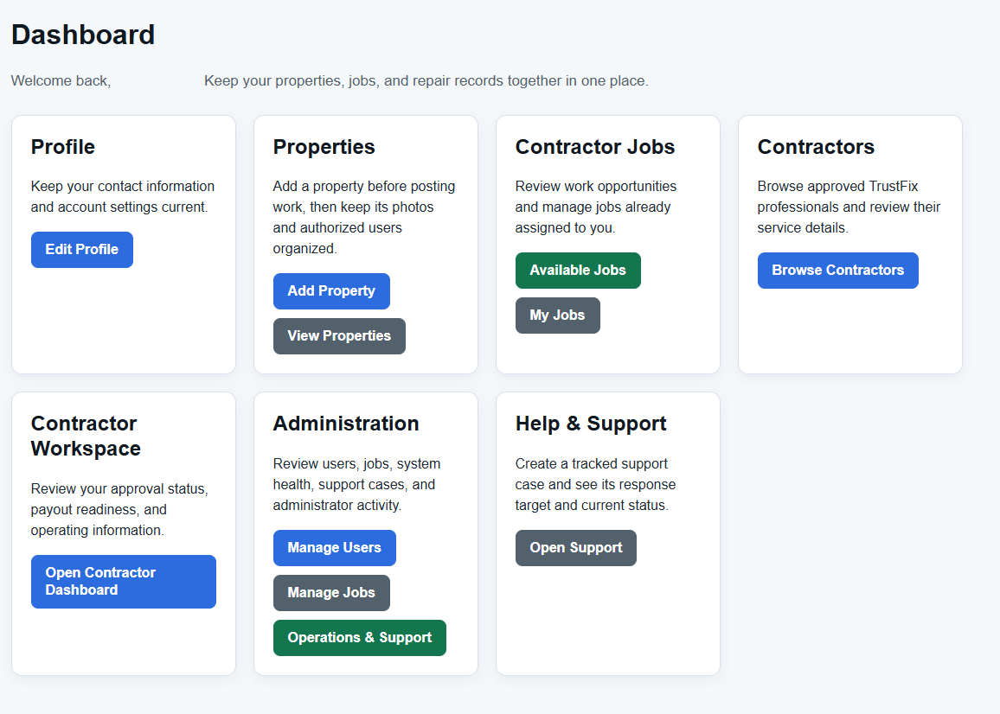
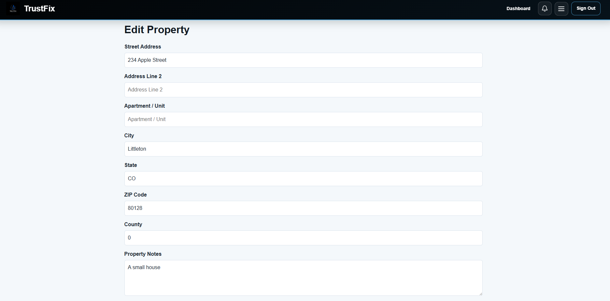
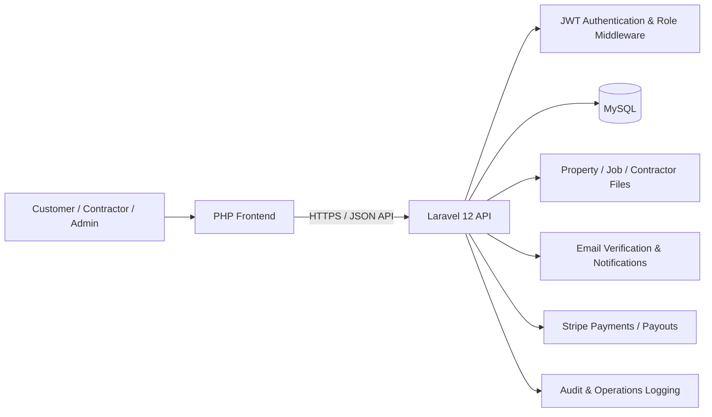

# TrustFix

**A production-oriented service-management platform connecting customers, contractors, and administrators through a structured home-service workflow.**

[](https://www.php.net/)
[](https://laravel.com/)
[](https://www.mysql.com/)
[](#project-status)

**Live application:** [trustfix.lakehousesoftware.com](https://trustfix.lakehousesoftware.com/)

---

## Overview

TrustFix is a full-stack service-management application designed around the lifecycle of real home-service work.

Customers can manage properties, create jobs, upload photos, review estimates, communicate during a job, approve changes, make payments, and leave reviews. Contractors can maintain profiles and credentials, discover and accept work, manage job progress, upload documentation, and receive payouts. Administrators have tools for user management, contractor verification, document review, support cases, disputes, audit activity, pricing data, and operational oversight.

The project is intentionally more than a CRUD demo. It is built around **role-based workflows, production operations, account security, file/document handling, payments, messaging, and auditable administrative actions**.

---

## Screenshots

<p align="center">
  
</p>

<p align="center">
  <em>TrustFix dashboard and role-based application navigation.</em>
</p>

<p align="center">
  
</p>

<p align="center">
  <em>TrustFix job, property, contractor, or administrative workflow.</em>
</p>

---

## What It Does

### Customer / Property Owner

- Account registration, authentication, email verification, and password recovery
- Property creation and management
- Property image uploads
- Job creation and editing
- Job photo uploads
- Estimate and quote review
- Job workspace and activity history
- Direct job messaging
- Change-order approval
- Payment workflow
- Contractor reviews
- Support cases and dispute reporting

### Contractor / Handyman

- Contractor profile management
- Skills and service information
- Credential and document uploads
- Contractor onboarding
- Available-job discovery
- Job acceptance and status progression
- Job estimates and revisions
- Actual-hours/material tracking
- Job messaging and activity history
- Payout-account workflow
- Profile-claim workflow

### Administrator

- Administrative dashboard and operational summaries
- User management
- Account status controls
- Job review and management
- Contractor/profile oversight
- Contractor document approval and denial
- Badge management
- Review moderation
- Support-case management
- Dispute management
- Reporting workflow
- Material-price administration
- Estimate training / accuracy data
- Administrative audit logs

---

## Architecture

TrustFix separates the browser-facing application from the API/backend.



### Repository Layout

```text
trustfix.ai/
├── backend/                  # Laravel 12 API application
│   ├── app/
│   ├── config/
│   ├── database/
│   ├── public/
│   ├── resources/
│   ├── routes/
│   ├── storage/
│   └── tests/
├── frontend/                 # PHP/CSS/JavaScript browser application
│   ├── css/
│   ├── images/
│   ├── js/
│   ├── config.php
│   ├── dashboard.php
│   └── ...
├── docs/                     # Operational/support documentation
└── README.md
```

---

## Technology Stack

| Layer | Technology |
|---|---|
| Backend | PHP 8.2+, Laravel 12 |
| API authentication | JWT |
| Production database | MySQL |
| Local database option | SQLite |
| Frontend | PHP, HTML, CSS, JavaScript |
| Backend assets | Vite / npm |
| Payments | Stripe payment and connected-account workflows |
| Email | Laravel mail configuration |
| File handling | Laravel/PHP upload and storage workflows |
| Testing | PHPUnit / Laravel test tooling |
| Hosting | Linux/shared-hosting compatible deployment |

---

## Authentication and Authorization

TrustFix uses authenticated API routes and role-based middleware to separate customer, contractor/handyman, company, and administrator capabilities.

Security-related application behavior includes:

- JWT-backed API authentication
- Protected API route groups
- Account-status middleware
- Role-based authorization
- Ownership checks on protected resources
- Login, registration, password-reset, and verification throttling
- Email verification
- Frontend CSRF tokens
- Secure/HTTP-only session cookies when HTTPS is active
- Security-related response headers
- Administrative audit logging
- Server-side validation and controlled file workflows

No credentials, API keys, production `.env` files, or private customer data should ever be committed to this repository.

---

## Local Development

### Requirements

Install:

- PHP **8.2 or newer**
- Composer
- Node.js / npm
- PHP extensions required by Laravel
- SQLite for the quickest local setup, or MySQL if you want to mirror production

### 1. Clone the repository

```bash
git clone https://github.com/fuhrdan/trustfix.ai.git
cd trustfix.ai/backend
```

### 2. Install backend dependencies

```bash
composer install
```

### 3. Create the environment file

```bash
cp .env.example .env
php artisan key:generate
```

On Windows Command Prompt:

```cmd
copy .env.example .env
php artisan key:generate
```

### 4. Configure the database

The supplied Laravel example configuration can use SQLite for local development.

For MySQL, update `.env`:

```env
DB_CONNECTION=mysql
DB_HOST=127.0.0.1
DB_PORT=3306
DB_DATABASE=trustfix
DB_USERNAME=your_database_user
DB_PASSWORD=your_database_password
```

Create the database before running migrations.

### 5. Run migrations

```bash
php artisan migrate
```

If seeders are appropriate for your development environment:

```bash
php artisan migrate --seed
```

### 6. Install/build backend assets

```bash
npm install
npm run build
```

For development:

```bash
npm run dev
```

### 7. Start the Laravel API

```bash
php artisan serve
```

The default local API is normally available at:

```text
http://127.0.0.1:8000
```

---

## Configuring the PHP Frontend

The browser-facing PHP frontend is located in:

```text
frontend/
```

It communicates with the Laravel backend through the configured API base URL.

The frontend supports deployment-specific configuration such as:

```text
TRUSTFIX_API_BASE
TRUSTFIX_API_TIMEOUT
TRUSTFIX_VERIFY_API_SSL
TRUSTFIX_SUPPORT_EMAIL
```

For example, a local API base could point to:

```text
http://127.0.0.1:8000/api
```

Production configuration should use HTTPS and should not commit production secrets.

---

## Email Configuration

For real email delivery, configure Laravel mail settings in the backend `.env`.

Example:

```env
MAIL_MAILER=smtp
MAIL_HOST=your-smtp-host
MAIL_PORT=587
MAIL_USERNAME=your-smtp-username
MAIL_PASSWORD=your-smtp-password
MAIL_ENCRYPTION=tls
MAIL_FROM_ADDRESS=noreply@example.com
MAIL_FROM_NAME="TrustFix"
```

Do not commit SMTP credentials.

TrustFix uses email workflows for account verification and password-related operations.

---

## Queue and Scheduler

Production deployments should run Laravel's scheduler regularly.

A typical cron entry is:

```cron
* * * * * cd /path/to/trustfix.ai/backend && /path/to/php artisan schedule:run >> /dev/null 2>&1
```

Only one scheduler entry is required.

If queued work is enabled in the deployment environment, run an appropriate Laravel queue worker or process manager.

---

## Production Deployment

A production deployment should generally include:

```bash
composer install --no-dev --optimize-autoloader
php artisan migrate --force
npm install
npm run build
php artisan optimize:clear
php artisan config:cache
php artisan route:cache
php artisan view:cache
```

Production environment settings should include:

```env
APP_ENV=production
APP_DEBUG=false
```

Additional production requirements:

- Serve exclusively over HTTPS
- Keep `.env` outside public access
- Use a dedicated database account with appropriate permissions
- Configure SMTP securely
- Configure Stripe secrets only through environment variables
- Keep uploaded documents outside executable paths
- Back up the database and user-uploaded files
- Run the Laravel scheduler
- Monitor application and web-server logs
- Test email verification, authentication, uploads, and payment callbacks after deployment

---

## Database and Migrations

Database schema changes are managed through Laravel migrations under:

```text
backend/database/migrations/
```

Use migrations rather than manually changing the production schema.

Development:

```bash
php artisan migrate
```

Production:

```bash
php artisan migrate --force
```

Before destructive schema work, take a database backup.

---

## Testing

The Laravel backend includes Laravel/PHPUnit test infrastructure.

Run:

```bash
cd backend
php artisan test
```

or:

```bash
composer test
```

For production-oriented changes, also smoke-test:

1. Registration and login
2. Email verification
3. Password reset
4. Role-based dashboard access
5. Property creation/editing
6. Job creation/editing
7. Image/document uploads
8. Contractor workflows
9. Admin approval workflows
10. Messaging and job status changes
11. Payment configuration/webhooks where enabled

---

## Operational Documentation

Operational/support documentation is stored under:

```text
docs/
```

This repository includes support/escalation documentation intended to make production support part of the application lifecycle rather than an afterthought.

---

## Project Status

TrustFix is an actively developed application deployed to a live environment. Features and deployment configuration continue to evolve as the product is refined.

The repository demonstrates work across:

- Full-stack application delivery
- REST/API design
- Authentication and authorization
- Business-system workflows
- Database design and migrations
- File/document management
- Payments
- Production deployment
- Shared-hosting operations
- Administrative tooling
- Support and auditability

---

## Known Limitations / Future Work

Areas that can continue to evolve include:

- Broader automated test coverage
- Additional CI/CD automation
- Expanded observability and production metrics
- Additional payment/dispute workflow hardening
- More extensive API documentation
- Improved automated deployment validation
- Continued mobile/responsive UX refinement

---

## Repository Notes

This repository contains application code and configuration examples only.

Do **not** commit:

- Production `.env` files
- Database dumps containing customer data
- SMTP credentials
- Stripe/API secrets
- Private contractor documents
- Uploaded identity/licensing documents
- Production logs containing sensitive information

---

## Author

**Daniel Fuhr**

- GitHub: [github.com/fuhrdan](https://github.com/fuhrdan)
- LinkedIn: [linkedin.com/in/danielfuhr](https://www.linkedin.com/in/danielfuhr/)
- Portfolio: [lakehousesoftware.com](https://lakehousesoftware.com/)

---

## Why This Project Matters

TrustFix demonstrates the kind of engineering work I enjoy most: taking a real operational problem and carrying it across **data modeling, authentication, APIs, business rules, user workflows, deployment, administration, security, and ongoing support**.

It is not intended to demonstrate a single framework feature. It demonstrates the ability to take a multi-role application from requirements to a working production system.
